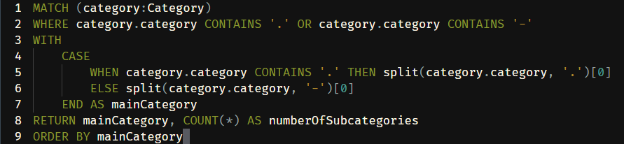

# Project arXiv Citation Network

## Contributors

-   [Minh Tran](https://minhtran-nine.vercel.app)
-   [Leo Ho](https://www.linkedin.com/in/quocleoho/)

## 0. Usage

### Data Preparation

To prepare the data, run the following command:

```bash
python3 cite_parser.py
```

This will generate csv files for the nodes and edges of the citation network.

### Neo4j Database

To load the data into a Neo4j database, run the following command:

```bash
python3 load_neo4j.py
```

This will load the data from the csv files into a Neo4j database.

> [!NOTE]
> If it takes too long to load the data, you can change the number of random samples in the `prepare_data.py` file (`N_SAMPLES` variable).

## 1. Introduction

This project aims to analyze the citation network of arXiv papers. We use Python to clean the data and create a Neo4j network to visualize and analyze the citation relationships between arXiv papers.

## 2. Data Description

The data was extracted from: [https://github.com/mattbierbaum/arxiv-public-datasets/releases/tag/v0.2.0](https://github.com/mattbierbaum/arxiv-public-datasets/releases/tag/v0.2.0). More exactly, we'll use the file `internal-references-v0.2.0-2019-03-01.json.gz`, which contains the list of papers and their references, all papers using their arXiv IDs and `oai-arxiv-metadata-hash-abstracts-2019-03-01.json`, which contains the metadata of the papers.

The processed dataset is stored in JSON format. It contains metadata for arXiv papers, including titles, authors, abstracts, and references. The data is stored in two files:

-   `data/oai-arxiv-metadata-hash-abstracts-2019-03-01.json`
-   `data/internal-references-pdftotext.json`

### Neo4j Network

Using Neo4j, we created a citation network for the arXiv papers. The nodes represent papers and categories, while the edges represent citation and categorization relationships. By running the Neo4j command:

```cypher
MATCH (n) RETURN n
```

we visualize the citation network where:

-   **Paper nodes** have attributes such as:

    -   `elementId`: Element ID of the paper
    -   `id`: Identifier of the paper
    -   `abstract_md5`: MD5 hash of the abstract
    -   `authors`: List of authors
    -   `doi`: Digital Object Identifier
    -   `idAxv`: arXiv identifier
    -   `report_no`: Report number
    -   `submitter`: Paper submitter
    -   `title`: Paper title

-   **Category nodes** have attributes like:

    -   `elementId`: Element ID of the category
    -   `id`: Identifier of the category in the graph
    -   `category`: Name of the category

-   **Relationships**:
    -   **CATEGORIZED**: Connects papers to categories. It has attributes `elementId` and `id`.
    -   **CITES**: Represents citations between papers. It has attributes `elementId` and `id`.

The network consists of **313 nodes** and **667 relationships**.


## 3. Analysis

### 3.1 Network Metrics

#### Average Citations per Paper

-   The average number of citations per paper is **0.783**.
-   This suggests that many papers are either not cited frequently or not cited at all.


#### Papers per Category

-   The following graph shows the distribution of papers across different categories.


| Category Name      | Number of Papers |
| ------------------ | ---------------- |
| hep-ph             | 95               |
| hep-th             | 80               |
| astro-ph           | 73               |
| gr-qc              | 28               |
| hep-ex             | 22               |
| quant-ph           | 17               |
| math.MP            | 13               |
| math-ph            | 13               |
| cond-mat.mes-hall  | 8                |
| math.AG            | 8                |
| cond-mat.other     | 7                |
| nucl-th            | 7                |
| math.QA            | 7                |
| cond-mat.stat-mech | 6                |
| cond-mat.mtrl-sci  | 6                |
| cond-mat.dis-nn    | 5                |
| math.CV            | 5                |
| cond-mat.str-el    | 5                |
| math.GR            | 4                |
| math.RT            | 4                |
| math.DG            | 4                |
| nucl-ex            | 4                |
| hep-lat            | 3                |
| math.SG            | 3                |
| math.RA            | 3                |
| math.DS            | 2                |
| math.CO            | 2                |
| cond-mat.supr-con  | 2                |
| math.NT            | 2                |
| physics.soc-ph     | 2                |
| nlin.SI            | 2                |
| math.GT            | 2                |
| physics.data-an    | 2                |
| q-fin.ST           | 2                |
| math.GN            | 1                |
| cs.DM              | 1                |

#### Category Distribution

| mainCategory | numberOfSubcategories |
| ------------ | --------------------- |
| astro        | 1                     |
| cond-mat     | 7                     |
| cs           | 1                     |
| gr           | 1                     |
| hep          | 4                     |
| math         | 15                    |
| nlin         | 1                     |
| nucl         | 2                     |
| physics      | 2                     |
| q-fin        | 1                     |
| quant        | 1                     |

- Papers that belong to more than one main category:


| title                                                                 | mainCategories                |
| --------------------------------------------------------------------- | ----------------------------- |
| A compact star rotating at 1122 Hz and the r-mode instability         | ["gr", "hep", "nucl", "astro"]|
| The Mathematical Universe                                             | ["gr", "hep", "astro"]        |
| String inspired explanation for the super-acceleration of our universe| ["gr", "hep", "astro"]        |
| An Inverse $f(R)$ Gravitation for Cosmic Speed up, and Dark Energy    | ["gr", "hep", "astro"]        |
| Z^0 \to 2\gamma and the Twisted Coproduct of the Poincar\'{e} Group   | ["gr", "math", "hep"]         |
| Bouncing Universe with Quintom Matter                                 | ["gr", "hep", "astro"]        |
| Extra force in $f(R)$ modified theories of gravity                    | ["gr", "hep", "astro"]        |
| UV stable, Lorentz-violating dark energy with transient phantom era   | ["gr", "hep", "astro"]        |
| Absence of the Fifth Force Problem in a Model with Spontaneously Brok | ["gr", "hep", "astro"]        |
| Dark energy from modified F(R)-scalar-Gauss-Bonnet gravity            | ["gr", "hep", "astro"]        |
| Hybrid Chaplygin gas and phantom divide crossing                      | ["gr", "hep", "astro"]        |
| Interacting Energy Components and Observational $H(z)$ Data           | ["gr", "hep", "astro"]        |
| Phantom field dynamics in loop quantum cosmology                      | ["gr", "hep", "astro"]        |
| Towards observable signatures of other bubble universes               | ["gr", "hep", "astro"]        |
| Casimir effect in a 6D warped flux compactification model             | ["gr", "hep", "astro"]        |
| Dynamics of a quantum phase transition in a ferromagnetic Bose-Einste | ["cond-mat", "hep", "quant"]  |
| Projective Hilbert space structures at exceptional points             | ["cond-mat", "math", "quant"] |
| Space of Quantum Theory Representations of Natural Numbers, Integers, | ["math", "hep", "quant"]      |
| The S-Matrix of AdS/CFT and Yangian Symmetry                          | ["hep", "cond-mat", "nlin"]   |
| A-infinity structure on simplicial complexes                          | ["hep", "math", "cs"]         |
| Contraints on radiative dark-matter decay from the cosmic microwave   | ["hep", "astro"]              |
| Fermionic formulas for (1,p) logarithmic model characters in \Phi_{2, | ["hep", "math"]               |
| Higher Nilpotent Analogues of A-infinity Structure                    | ["hep", "math"]               |
| Neumann and Neumann-Rosochatius integrable systems from membranes on  | ["hep", "nlin"]               |
| Direct photons and dileptons via color dipoles                        | ["hep", "nucl"]               |
| Constraints on the Very Early Universe from Thermal WIMP Dark Matter  | ["hep", "astro"]              |
| Resolving Cosmic Gamma Ray Anomalies with Dark Matter Decaying Now    | ["hep", "astro"]              |
| Strange stars and the cosmological constant problem                   | ["hep", "astro"]              |
| Ultra-High Energy Cosmic Rays and the GeV-TeV Diffuse Gamma-Ray Flux  | ["hep", "astro"]              |
| Possible solution to the $^7$Li problem by the long lived stau        | ["hep", "astro"]              |
| Signatures of axion-like particles in the spectra of TeV gamma-ray so | ["hep", "astro"]              |
| Diffuse cosmic gamma-rays at 1-20 MeV: A trace of the dark matter?    | ["hep", "astro"]              |
| The Epps effect revisited                                             | ["physics", "q-fin"]          |
| Modeling the Epps effect of cross correlations in asset prices        | ["physics", "q-fin"]          |
| Entanglement entropy at infinite randomness fixed points in higher di | ["cond-mat", "quant"]         |
| Spin Evolution of Accreting Neutron Stars: Nonlinear Development of t | ["gr", "astro"]               |
| Charges from Attractors                                               | ["gr", "hep"]                 |
| Euclidean analysis of the entropy functional formalism                | ["gr", "hep"]                 |
| A Way to Dynamically Overcome the Cosmological Constant Problem       | ["gr", "astro"]               |
| Type I singularities and the Phantom Menace                           | ["gr", "hep"]                 |
| Phenomenological template family for black-hole coalescence waveforms | ["gr", "astro"]               |
| The critical temperature for the BCS equation at weak coupling        | ["cond-mat", "math"]          |
| Strong photon non-linearities and photonic Mott insulators            | ["cond-mat", "quant"]         |
| Effective spin systems in coupled micro-cavities                      | ["cond-mat", "quant"]         |
| Strong decays of charmed baryons                                      | ["nucl", "hep"]               |
| Relativistic Hydrodynamics at RHIC and LHC                            | ["nucl", "hep"]               |
| Improved Measurement of the Positive Muon Lifetime and Determination  | ["nucl", "hep"]               |
| Phenomenology with Massive Neutrinos                                  | ["hep", "astro"]              |
| Phenomenology of GUT-less Supersymmetry Breaking                      | ["hep", "astro"]              |
| Searching for Lee-Wick Gauge Bosons at the LHC                        | ["hep", "astro"]              |
| The Orbifolds of Permutation-Type as Physical String Systems at  Mult | ["math", "hep"]               |
| A New Algebraic Structure of Finite Quantum Systems and the Modified  | ["math", "quant"]             |
| Proof of the Flohr-Grabow-Koehn conjectures for characters of  logari | ["math", "hep"]               |
| Complex data processing: fast wavelet analysis on the sphere          | ["math", "astro"]             |
| The Orbifolds of Permutation-Type as Physical String Systems at  Mult | ["math", "hep"]               |
| Long Distance Signaling Using Axion-like Particles                    | ["hep", "astro"]              |
| The dynamical Casimir effect in braneworlds                           | ["hep", "astro"]              |
| Dynamical Casimir effect for gravitons in bouncing braneworlds        | ["hep", "astro"]              |
| Constraints on Regge models from perturbation theory                  | ["hep", "nucl"]               |
| Route to Lambda in conformally coupled phantom cosmology              | ["hep", "astro"]              |
| Scaling cosmologies, geodesic motion and pseudo-susy                  | ["hep", "astro"]              |
| Braneworld Cosmology                                                  | ["hep", "astro"]              |
| Cosmological Symmetry Breaking, Pseudo-scale invariance, Dark Energy  | ["hep", "astro"]              |


-   The number of being cited for each paper:


| Title                                                                                                                                              | Number of Cited |
| -------------------------------------------------------------------------------------------------------------------------------------------------- | --------------- |
| Stringy Instantons at Orbifold Singularities                                                                                                       | 3               |
| Analytic solutions for marginal deformations in open superstring field theory                                                                      | 3               |
| Marginal Solutions for the Superstring                                                                                                             | 3               |
| Charges from Attractors                                                                                                                            | 3               |
| Direct extraction of one-loop integral coefficients                                                                                                | 3               |
| Numerical Evaluation of Six-Photon Amplitudes                                                                                                      | 3               |
| A data-analysis driven comparison of analytic and numerical coalescing binary waveforms: nonspinning case                                          | 3               |
| The S-parameter in Holographic Technicolor Models                                                                                                  | 3               |
| A Search for Electron Neutrino Appearance at the Delta m<sup>2</sup> ~ 1 eV<sup>2</sup> Scale                                                      | 2               |
| Phenomenology with Massive Neutrinos                                                                                                               | 2               |
| Implication of the D^0 Width Difference On CP-Violation in D^0-\bar D^0 Mixing                                                                     | 2               |
| Measurement of D0-D0bar mixing in D0->Ks pi+ pi- decays                                                                                            | 2               |
| Quantum Hall Effect in a Graphene p-n Junction                                                                                                     | 2               |
| Measurement of B(D*S^+ --> ell^+ nu) and the Decay Constant f_D*{S^+}                                                                              | 2               |
| Dynamical Casimir effect for gravitons in bouncing braneworlds                                                                                     | 2               |
| Strong Phase and $D^0-D^0bar$ mixing at BES-III                                                                                                    | 2               |
| D-\bar D mixing and rare D decays in the Littlest Higgs model with non-unitarity matrix                                                            | 2               |
| The dynamical Casimir effect in braneworlds                                                                                                        | 2               |
| An exact sequence for contact- and symplectic homology                                                                                             | 2               |
| Fractal dimension of domain walls in two-dimensional Ising spin glasses                                                                            | 2               |
| Averages of b-hadron properties at the end of 2006                                                                                                 | 2               |
| Pseudo-supersymmetry and a Tale of Alternate Realities                                                                                             | 2               |
| Two Results on Homogeneous Hessian Nilpotent Polynomials                                                                                           | 2               |
| Electroweak Higgs as a pseudo-Goldstone boson of broken scale invariance                                                                           | 2               |
| Route to Lambda in conformally coupled phantom cosmology                                                                                           | 2               |
| Measuring the dark side (with weak lensing)                                                                                                        | 2               |
| Symplectic homology, autonomous Hamiltonians, and Morse-Bott moduli spaces                                                                         | 2               |
| The S-Matrix of AdS/CFT and Yangian Symmetry                                                                                                       | 2               |
| The Determination of the Helicity of $W'$ Boson Couplings at the LHC                                                                               | 2               |
| Reconciling the X(3872) with the near-threshold enhancement in the D^0\bar{D}^{\*0} final state                                                    | 2               |
| Improved Measurement of the Positive Muon Lifetime and Determination of the Fermi Constant                                                         | 2               |
| Measurement of the Rate of Muon Capture in Hydrogen Gas and Determination of the Proton's Pseudoscalar Coupling $g_P$                              | 2               |
| Resolving Cosmic Gamma Ray Anomalies with Dark Matter Decaying Now                                                                                 | 2               |
| Collider signals in unparticle physics                                                                                                             | 2               |
| Study of B+ to p Lambdabar gamma, p Lambdabar pi0 and B0 to p Lambdabar pi-                                                                        | 2               |
| A method for the direct determination of the surface gravities of transiting extrasolar planets                                                    | 2               |
| Flavour-Dependent Type II Leptogenesis                                                                                                             | 2               |
| Scaling cosmologies, geodesic motion and pseudo-susy                                                                                               | 2               |
| Swift/XRT observes the fifth outburst of the periodic Supergiant Fast X-ray Transient IGR J11215-5952                                              | 1               |
| Quantum Hacking: Experimental demonstration of time-shift attack against practical quantum key distribution systems                                | 1               |
| Cosmological constraints combining H(z), CMB shift and SNIa observational data                                                                     | 1               |
| ATLAS Discovery Potential for the Charged Higgs Boson in H+ to tau nu Decays                                                                       | 1               |
| Jumping Through Loops: On Soft Terms from Large Volume Compactifications                                                                           | 1               |
| Type I singularities and the Phantom Menace                                                                                                        | 1               |
| Bubbling Surface Operators And S-Duality                                                                                                           | 1               |
| Bubbling AdS and droplet descriptions of BPS geometries in IIB supergravity                                                                        | 1               |
| Limits on WIMP-nucleon interactions with CsI(Tl) crystal detectors                                                                                 | 1               |
| Sparticle Spectra and LHC Signatures for Large Volume String Compactifications                                                                     | 1               |
| The Lee-Wick Standard Model                                                                                                                        | 1               |
| Testing the Standard Model by precision measurement of the weak charges of quarks                                                                  | 1               |
| A Measure of de Sitter Entropy and Eternal Inflation                                                                                               | 1               |
| Another Odd Thing About Unparticle Physics                                                                                                         | 1               |
| Exact Mapping of the 2+1 Dirac Oscillator onto the Jaynes-Cummings Model: Ion-Trap Experimental Proposal                                           | 1               |
| Relativistic Hydrodynamics at RHIC and LHC                                                                                                         | 1               |
| A calculation of the shear viscosity in SU(3) gluodynamics                                                                                         | 1               |
| Many-Body Physics with Ultracold Gases                                                                                                             | 1               |
| The Mathematical Universe                                                                                                                          | 1               |
| Anomalous dimensions at twist-3 in the sl(2) sector of N=4 SYM                                                                                     | 1               |
| Braneworld Cosmology                                                                                                                               | 1               |
| Phantom field dynamics in loop quantum cosmology                                                                                                   | 1               |
| Density dependent hadronic models and the relation between neutron stars and neutron skin thickness                                                | 1               |
| Transport measurements across a tunable potential barrier in graphene                                                                              | 1               |
| Marginal deformations in string field theory                                                                                                       | 1               |
| Gauge Mediation in String Theory                                                                                                                   | 1               |
| The Casimir Force in Randall Sundrum Models                                                                                                        | 1               |
| Light projectile scattering off the Color Glass Condensate                                                                                         | 1               |
| Boundaries and the Casimir effect in non-commutative space-time                                                                                    | 1               |
| Casimir effect in a 6D warped flux compactification model                                                                                          | 1               |
| Reconstruction Algebras of Type A                                                                                                                  | 1               |
| Dressing and Wrapping                                                                                                                              | 1               |
| The Orbifolds of Permutation-Type as Physical String Systems at Multiples of $c=26$ III. The Spectra of $\hat{c}=52$ Strings                       | 1               |
| The Special McKay correspondence as an equivalence of derived categories                                                                           | 1               |
| Mapping the Cosmological Confidence Ball Surface                                                                                                   | 1               |
| Probing dark energy with steerable wavelets through correlation of WMAP and NVSS local morphological measures                                      | 1               |
| Halo-model signatures from 380,000 SDSS Luminous Red Galaxies with photometric redshifts                                                           | 1               |
| Search for gravitational waves from binary inspirals in S3 and S4 LIGO data                                                                        | 1               |
| The Epps effect revisited                                                                                                                          | 1               |
| Right-Handed Quark Mixings in Minimal Left-Right Symmetric Model with General CP Violation                                                         | 1               |
| An algorithm for the classification of smooth Fano polytopes                                                                                       | 1               |
| On-Shell Methods in Perturbative QCD                                                                                                               | 1               |
| Placeholder Substructures III: A Bit-String-Driven ''Recipe Theory'' for Infinite-Dimensional Zero-Divisor Spaces                                  | 1               |
| Placeholder Substructures II: Meta-Fractals, Made of Box-Kites, Fill Infinite-Dimensional Skies                                                    | 1               |
| GRB 061121: Broadband spectral evolution through the prompt and afterglow phases of a bright burst                                                 | 1               |
| D-brane Instantons on the T^6/Z\*3 orientifold                                                                                                     | 1               |
| Multiple Unfoldings of Orbifold Singularities: Engineering Geometric Analogies to Unification                                                      | 1               |
| Complex data processing: fast wavelet analysis on the sphere                                                                                       | 1               |
| Signal for space-time noncommutativity: the Z -> gamma gamma decay in the renormalizable gauge sector of the theta-expanded NCSM                   | 1               |
| Lower order terms in the 1-level density for families of holomorphic cuspidal newforms                                                             | 1               |
| On the Origin of the Dichotomy of Early-Type Galaxies: The Role of Dry Mergers and AGN Feedback                                                    | 1               |
| The Isophotal Structure of Early-Type Galaxies in the SDSS: Dependence on AGN Activity and Environment                                             | 1               |
| Heisenberg antiferromagnet with anisotropic exchange on the Kagome lattice: Description of the magnetic properties of volborthite                  | 1               |
| Real analytic solutions for marginal deformations in open superstring field theory                                                                 | 1               |
| Curvature flows in semi-Riemannian manifolds                                                                                                       | 1               |
| String inspired explanation for the super-acceleration of our universe                                                                             | 1               |
| Strong decays of charmed baryons                                                                                                                   | 1               |
| Search for Heavy Neutral MSSM Higgs Bosons with CMS: Reach and Higgs-Mass Precision                                                                | 1               |
| Droplets in the two-dimensional +-J spin glass: evidence for (non-) universality                                                                   | 1               |
| Entanglement entropy at infinite randomness fixed points in higher dimensions                                                                      | 1               |
| The Goldberger-Miyazawa-Oehme sum rule revisited                                                                                                   | 1               |
| One-loop phi-MHV amplitudes using the unitarity bootstrap                                                                                          | 1               |
| High Energy Afterglow from Gamma-ray Bursts                                                                                                        | 1               |
| Dynamics of a quantum phase transition in a ferromagnetic Bose-Einstein condensate                                                                 | 1               |
| Spin Evolution of Accreting Neutron Stars: Nonlinear Development of the R-mode Instability                                                         | 1               |
| Monoid generalizations of the Richard Thompson groups                                                                                              | 1               |
| Constraints on Regge models from perturbation theory                                                                                               | 1               |
| Contraints on radiative dark-matter decay from the cosmic microwave background                                                                     | 1               |
| Diffuse cosmic gamma-rays at 1-20 MeV: A trace of the dark matter?                                                                                 | 1               |
| Some Properties of and Open Problems on Hessian Nilpotent Polynomials                                                                              | 1               |
| The Measurement Calculus                                                                                                                           | 1               |
| Green's function of a finite chain and the discrete Fourier transform                                                                              | 1               |
| Bouncing Universe with Quintom Matter                                                                                                              | 1               |
| Numerical solution of shock and ramp compression for general material properties                                                                   | 1               |
| Instanton Induced Neutrino Majorana Masses in CFT Orientifolds with MSSM-like spectra                                                              | 1               |
| A Way to Dynamically Overcome the Cosmological Constant Problem                                                                                    | 1               |
| Domain wall entropy of the bimodal two-dimensional Ising spin glass                                                                                | 1               |
| Finite bias visibility of the electronic Mach-Zehnder interferometer                                                                               | 1               |
| Kirillov-Reshetikhin conjecture : the general case                                                                                                 | 1               |
| Second-order perturbations of cosmological fluids: Relativistic effects of pressure, multi-component, curvature, and rotation                      | 1               |
| A compact star rotating at 1122 Hz and the r-mode instability                                                                                      | 1               |
| Epitaxial graphene                                                                                                                                 | 1               |
| Direct photons and dileptons via color dipoles                                                                                                     | 1               |
| A Survey of Huebschmann and Stasheff's Paper: Formal Solution of the Master Equation via HPT and Deformation Theory                                | 1               |
| Counting BPS operators in N=4 SYM                                                                                                                  | 1               |
| The Dynamics of Quintessence, The Quintessence of Dynamics                                                                                         | 1               |
| Polymer Quantum Mechanics and its Continuum Limit                                                                                                  | 1               |
| Lattice refining loop quantum cosmology, anisotropic models and stability                                                                          | 1               |
| Two-loop QED corrections to Bhabha scattering                                                                                                      | 1               |
| The angular correlations of galaxies in the COSMOS field                                                                                           | 1               |
| Vortex proliferation in the Berezinskii-Kosterlitz-Thouless regime on a two-dimensional lattice of Bose-Einstein condensates                       | 1               |
| An Inverse $f(R)$ Gravitation for Cosmic Speed up, and Dark Energy Equivalent                                                                      | 1               |
| Generalization of Einstein-Lovelock theory to higher order dilaton gravity                                                                         | 1               |
| Extra force in $f(R)$ modified theories of gravity                                                                                                 | 1               |
| Supersymmetry breaking metastable vacua in runaway quiver gauge theories                                                                           | 1               |
| Redefining the Missing Satellites Problem                                                                                                          | 1               |
| Equation of State in Relativistic Magnetohydrodynamics: variable versus constant adiabatic index                                                   | 1               |
| Higher Nilpotent Analogues of A-infinity Structure                                                                                                 | 1               |
| Dynamic rays of bounded-type entire functions                                                                                                      | 1               |
| Measurement of the Decay Constant $f_D{_S^+}$ using $D_S^+ --> ell^+ nu                                                                            | 1               |
| Observation of the Decay \bar{B0}-> Ds+ Lambda \bar{p}                                                                                             | 1               |
| Representations admitting two pairs of supplementary invariant spaces                                                                              | 1               |
| Constraints on the Very Early Universe from Thermal WIMP Dark Matter                                                                               | 1               |
| Possible solution to the $^7$Li problem by the long lived stau                                                                                     | 1               |
| One-loop MHV Rules and Pure Yang-Mills                                                                                                             | 1               |
| Combinatorial structure of Kirillov-Reshetikhin crystals of type D_n(1), B_n(1), A\*{2n-1}(2)                                                      | 1               |
| A sequence of blowing-ups connecting moduli of sheaves and the Donaldson polynomial under change of polarization                                   | 1               |
| A-infinity structure on simplicial complexes                                                                                                       | 1               |
| The Blazar Spectral Sequence and GLAST                                                                                                             | 1               |
| Extended solar emission - an analysis of the EGRET data                                                                                            | 1               |
| The Spectral Index Distribution of EGRET Blazars: Prospects for GLAST                                                                              | 1               |
| Ultra-High Energy Cosmic Rays and the GeV-TeV Diffuse Gamma-Ray Flux                                                                               | 1               |
| The Mass and Radius of the Unseen M-Dwarf Companion in the Single-Lined Eclipsing Binary HAT-TR-205-013                                            | 1               |
| Renormalization group flows and quantum phase transitions: fidelity versus entanglement                                                            | 1               |
| Fidelity approach to quantum phase transitions: finite size scaling for quantum Ising model in a transverse field                                  | 1               |
| Projective Hilbert space structures at exceptional points                                                                                          | 1               |
| Canonical Deformed Groups of Diffeomorphisms and Finite Parallel Transports in Riemannian Spaces                                                   | 1               |
| Entanglement increase from local interactions with not-completely-positive maps                                                                    | 1               |
| Group-theoretic Description of Riemannian Spaces                                                                                                   | 1               |
| A practical Seedless Infrared-Safe Cone jet algorithm                                                                                              | 1               |
| Controlled collisions of a single atom and ion guided by movable trapping potentials                                                               | 1               |
| Strong photon non-linearities and photonic Mott insulators                                                                                         | 1               |
| Developing the Galactic diffuse emission model for the GLAST Large Area Telescope                                                                  | 1               |
| Semiclassical Quantization of the Giant Magnon                                                                                                     | 1               |
| Vector mesons from AdS/TC to the LHC                                                                                                               | 1               |
| Generalized MICZ-Kepler Problems and Unitary Highest Weight Modules - II                                                                           | 1               |
| Fermionic formulas for (1,p) logarithmic model characters in \Phi\_{2,1} quasiparticle realisation                                                 | 1               |
| I. The mass gap and solution of the quark confinement problem in QCD                                                                               | 1               |
| Long Distance Signaling Using Axion-like Particles                                                                                                 | 1               |
| Experimental Challenges Involved in Searches for Axion-Like Particles and Nonlinear Quantum Electrodynamic Effects by Sensitive Optical Techniques | 1               |
| Impact of spin-zero particle-photon interactions on light polarization in external magnetic fields                                                 | 1               |
| Signatures of axion-like particles in the spectra of TeV gamma-ray sources                                                                         | 1               |
| Non-Abelian Chern-Simons Vortices                                                                                                                  | 1               |

-   The author with more than 1 paper:


| Author Name                             | Number of Papers |
| --------------------------------------- | ---------------- |
| Robert P. C. de Marrais                 | 2                |
| Thomas G. Rizzo                         | 2                |
| Claus Gerhardt                          | 2                |
| Jacob L. Bourjaily                      | 2                |
| Steven J. Miller                        | 2                |
| Yuji Okawa (DESY)                       | 2                |
| Frédéric Bourgeois and Alexandru Oancea | 2                |
| Wenhua Zhao                             | 2                |
| V. Gogokhia                             | 2                |
| J. Hwang and H. Noh                     | 2                |
| V. Dolotin, A. Morozov and Sh. Shakirov | 2                |
| Kimiko Yamada                           | 2                |
| Guowu Meng                              | 2                |
| Serhiy E. Samokhvalov                   | 2                |

Maximums:

-   The table reveals that the most popular category is _hep-ph_ (High Energy Physics - Phenomenology) with 95 papers, followed by _hep-th_ (High Energy Physics - Theory) with 80 papers. The least popular categories are _math.GN_ (General Topology) and _cs.DM_ (Discrete Mathematics), each with only 1 paper.
-   The most frequently cited paper is titled "Stringy Instantons at Orbifold Singularities," which has been cited 3 times.
-   The maximum number of papers authored by a single author is 2, with 14 different authors contributing exactly 2 papers each.

Density:

-   The network's density is calculated as 217 (the total number of `CITES` links) divided by 38,226 (the total number of possible `PAPER` node pairs), yielding a density of 0.005. This indicates that the network is very sparse, which is typical of citation networks. Not all papers cite every other paper, and citations are generally selective.

### 3.2 Node pair metrics

-   The most cocitation:


-   We picked the top 4 cocitation pairs to show the most cocitation pairs since the table is too long to show all of them.

| Paper1                                                                                       | Paper2                                                                                                                  | CoCitationCount |
| -------------------------------------------------------------------------------------------- | ----------------------------------------------------------------------------------------------------------------------- | --------------- |
| "Strong Phase and $D^0-D^0bar$ mixing at BES-III"                                            | "D-\bar D mixing and rare D decays in the Littlest Higgs model with non-unitarity matrix"                               | 2               |
| "Marginal Solutions for the Superstring"                                                     | "Analytic solutions for marginal deformations in open superstring field theory"                                         | 2               |
| "Numerical Evaluation of Six-Photon Amplitudes"                                              | "Direct extraction of one-loop integral coefficients"                                                                   | 2               |
| "Improved Measurement of the Positive Muon Lifetime and Determination of the Fermi Constant" | "Measurement of the Rate of Muon Capture in Hydrogen Gas and Determination of the Proton's Pseudoscalar Coupling $g_P$" | 2               |

-   The table is make sense since the most cocitation pairs are the pairs that are related to each other. For example, the first pair is about the mixing of D mesons and the second pair is about the marginal solutions for the superstring.
-   The most bibliographic coupling:


| Paper1                                                                            | Paper2                                                                               | BibliographicCouplingCount |
| --------------------------------------------------------------------------------- | ------------------------------------------------------------------------------------ | -------------------------- |
| "Implication of the D^0 Width Difference On CP-Violation i n D^0-\bar D^0 Mixing" | "D0-anti-D0 Mixing and CP Violation in D0 vs anti-D0 to K\* (+-) K(-+) Decays"       | 2                          |
| "Marginal deformations in string field theory"                                    | "Real analytic solutions for marginal deformations in open superstring field theory" | 2                          |
| "On-Shell Methods in Perturbative QCD"                                            | "One-loop phi-MHV amplitudes using the unitarity bootstrap"                          | 2                          |
| "Muon Physics: A Pillar of the Standard Model"                                    | "Electroweak Radiative Corrections to Muon Capture"                                  | 2                          |

-   From the cocitation and bibliographic coupling tables, we can see that the most cocitation and bibliographic coupling pairs are related to each other. On the one hand, the number of cocitation and bibliographic coupling pairs is very low compared to the number of papers. This is because not all papers are cited by all other papers and vice versa which is common in citation networks.

### 3.3 Nodes Metrics

1. **The paper with the highest degree (using Neuler):**

    

    The result shows that the paper titled _"Moriond QCD 2007 - Theory Summary"_ has the most connections to other papers, with 5 citations.

2. **The paper with the highest betweenness centrality (using Neuler):**

    

    The result shows that the paper titled _"Moriond QCD 2007 - Theory Summary"_ has the highest betweenness centrality with a score of 24. This indicates that this paper plays the most crucial role in the network, acting as a bridge on the shortest paths between other papers.

3. **The paper with the highest closeness centrality (using Neuler):**

    

    The result shows that all papers have the same closeness centrality score of 1. This suggests that each paper is equally close to all other papers in the network, meaning they either cite or are cited by each other. This is typical in citation networks where papers are interconnected.

4. **The paper with the highest eigenvector centrality (using Neuler):**

    

    The result shows that the following papers have the highest eigenvector centrality with a score of 0.45:

    - _"Marginal Solutions for the Superstring"_
    - _"Analytic Solutions for Marginal Deformations in Open Superstring Field Theory"_
    - _"Direct Extraction of One-Loop Integral Coefficients"_
    - _"Numerical Evaluation of Six-Photon Amplitudes"_

    This means that these papers are the most influential and prestigious in the network since they are cited by other important papers.

5. **Papers with the highest clustering coefficient (using Neuler):**

    
    
    

    The results show that there are 30 papers with the highest clustering coefficient of 1. This indicates that these papers form a highly interconnected cluster where they cite each other, which is common in citation networks, especially among papers in the same category.

## 4. Limitation

-   This analysis is that the Neo4j graph is not large enough to fully represent all 4,000 papers, which means the results may not be entirely accurate.
-   The analysis is based solely on the data present in the graph database, which may not provide a comprehensive view of the citation network.
-   The data is limited to arXiv papers, which may not represent the entire field of research in the scientific community.
-   The dataset is released in April 2019, which may not include the most recent papers and citations.
-   We just generate a subset of the data to analyze the network due to the limitation of the computer's memory and processing power. This may lead to inaccurate results.

## 5. Conclusion

Through the application of various data analysis techniques and tools, we effectively analyzed the citation network to identify key papers, popular categories, frequently co-cited and bibliographically coupled pairs, and influential publications. This analysis offers insights into the citation network's structure and the relationships among its papers.

However, the analysis is limited by the incomplete dataset within the graph database, which restricts a comprehensive representation of the network. Future work will prioritize refining the data collection algorithms to capture a more complete and accurate view of the citation network.

## 6. References

-   [arXiv Public Datasets](https://github.com/mattbierbaum/arxiv-public-datasets/releases/tag/v0.2.0)
-   [Neo4j](https://neo4j.com/)
-   [Neuler](https://neuler.graphapp.io/)
-   [Python](https://www.python.org/)
-   [Pandas](https://pandas.pydata.org/)

